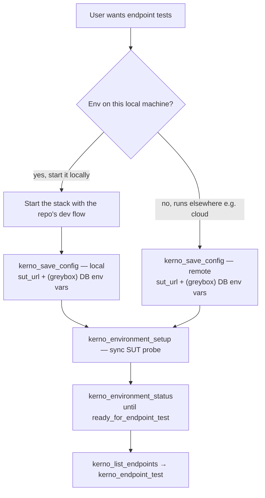

# Target environment

Two choices drive **`kerno_save_config`**:

1. **Where the SUT runs** — **`target_environment`**: **`local`** or **`remote`** (exact values only).
2. **DB-access posture** — **greybox** (recommended) or **black box** (fallback).

These are orthogonal: the first is *where* the system-under-test runs, the second is *whether Kerno can reach its database directly*.

## Where the SUT runs

| Choice | When | Client action before save_config | `sut_url` |
|--------|------|-----------------------------------|-----------|
| **`local`** (default) | The env runs on **this machine** | Start the stack with the repo's own dev flow (`docker-compose`, dev scripts, Makefile, devcontainer, quickstart) **first**, then save config | Required — probed from ts-sandbox |
| **`remote`** | The env runs **somewhere other than this machine** (e.g. a cloud / hosted environment) | Make sure it's reachable at its URL | Required — probed from ts-sandbox |

On the **local** path the MCP client starts the stack with the repository's own scripts or dev flow **first**, then calls **`kerno_save_config`** with the live SUT URL (and, for greybox, dependency env vars). Use **`remote`** when the environment lives somewhere other than this machine — e.g. a cloud or hosted environment — reachable at a URL.

**`kerno_save_config`** probes reachability from inside ts-sandbox before persisting — see [workspace-config.md](workspace-config.md).

## DB-access posture: greybox vs black box

| Posture | What Kerno gets | Use when |
|---------|-----------------|----------|
| **Greybox** (recommended) | HTTP API **+ direct DB access** | You can give Kerno DB credentials (dependency env blocks) **and** it can derive the DB schema from the repo (or you point it at one). Scenarios that need the database run. |
| **Black box** (fallback) | HTTP API only | DB access can't be provisioned — no derivable schema and none can be supplied, or the DB isn't reachable. |

**Greybox is the recommended default.** Wire DB credentials via the dependency env blocks in **`kerno_save_config`**; DB-backed scenarios additionally require a schema Kerno can derive from the repo (or that you point it at). See [workspace-config.md](workspace-config.md#database-access-requires-a-derivable-schema).

**Black box is the fallback.** When DB access isn't possible, drive the endpoint through its HTTP surface only, and **tell the user the limitation**: scenarios that require direct database access will be reported **`[BLOCKED]`**; only API-level validation runs.

## Flow

## See also

- [workspace-config.md](workspace-config.md) — save_config fields, DB env blocks, host gateway, and schema derivation
- [unified-flow.md](unified-flow.md) — full checklist
