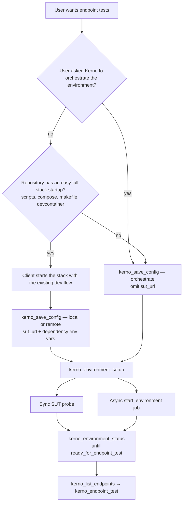

# Target environment decision tree

Choose **`target_environment`** in **`kerno_save_config`**. Valid values only: **`local`**, **`remote`**, **`orchestrate`**.

On the **local** path, the MCP client starts the stack with the repository's own scripts or development flow **first**, then calls **`kerno_save_config`** with the live SUT URL and dependency env vars. On the **orchestrate** path, **`kerno_save_config`** comes before **`kerno_environment_setup`** — Kerno owns bootstrap.

## Decision flow

**User override:** if the user explicitly asks Kerno to orchestrate, bootstrap, or bring up the full environment, use **`orchestrate`** even when the repository already has scripts or compose to start locally.

**Easy startup** means the project documents a routine way to run the full stack (for example `npm run dev`, `docker compose up`, `make run`) without Kerno generating Docker Compose or driving first-time environment build.

## Comparison

| Choice | When | Client action before save_config | `sut_url` | `environment_setup` behavior |
|--------|------|----------------------------------|-----------|------------------------------|
| **`local`** | Repo has easy startup; SUT runs on this machine | Start stack with existing dev flow | Required — probed from ts-sandbox | Sync SUT probe |
| **`remote`** | SUT already runs elsewhere (staging, teammate) | None — user or CI already started it | Required — probed from ts-sandbox | Sync SUT probe |
| **`orchestrate`** | No easy full-stack startup, **or** user asked Kerno to orchestrate | None — Kerno owns bootstrap | Omit | Compose-plan + async `start_environment` job |

## Orchestrate flow

When **`target_environment`** is **`orchestrate`**:

1. **`kerno_environment_setup`** — may return **`job_id`** for background work
2. **`kerno_get_state`** on composeplan resource_id — track plan generation and open questions
3. **`answer_feedback_request`** or **`kerno_feedback_pending`** / **`kerno_feedback_answer`** when feedback is open
4. Re-run **`kerno_environment_setup`** if needed after answering compose-plan questions
5. Poll **`kerno_job`** and **`kerno_environment_status`** until **`ready_for_endpoint_test`**

Compose-plan open questions and plan approval are handled via the read plane and feedback tools. See [state-and-jobs.md](state-and-jobs.md).

## Hard stops

**`needs_user_feedback`** on a **`start_environment`** job terminal payload is a **hard stop** — relay **`result.question`** to the user; do not proceed to endpoint tests until resolved.

## See also

- [workspace-config.md](workspace-config.md) — save_config fields and host gateway
- [unified-flow.md](unified-flow.md) — full checklist
